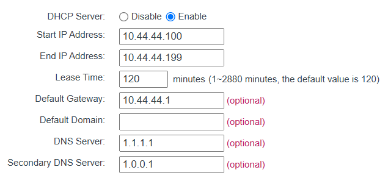

# raspberry-pi-kubernetes-cluster
Making a kubernetes cluster with Raspberry Pis

## Requirements
| Item                                 | Cost   |
| ------------------------------------ | ------ |
| Raspberry Pi v4 8GB                  | £60    |
| Raspberry Pi v5 8GB                  | £120   |
| Raspberry Pi PoE Hat                 | £60    |
| 5x0.5m CAT6 Ethernet Cable           | £8     |
| TP-Link TL-SF1005P 5-Port PoE Switch | £25    |
| TP-Link Nano Router WLAN             | £25    |
| 3x32GB MicroSD Card                  | £12    |
| Total                                | £310   |

## Raspberry pi setup

Install the Raspberry Pi Imager, then for the operating system select Ubuntu Server 24.10 (64-bit). For the other settings, make sure you dont add wifi settings as otherwise it wont connect to the TP Link Mini Router.

## Setting up TP Link Mini Router

To setup the switch and the router, connect the mini router to the 5th slot on the swtich, then the raspberry pis can connect on 1-4.

Connect your dev pc to the mini router's wifi network, then:

1. Quick Setup
2. WISP mode
3. Dynamic IP
4. Connect to your home wifi
5. Then go to Network -> LAN and set the ip address to 10.42.42.1 and subnet mask to 255.255.255.0
6. Then go to DHCP->DHCP Settings and set:
 
7. I then gave my raspberry pi's a fixed IP by first connecting them to the switch, getting their MAC address then going to DHCP->Address Reservation. I think its possible to set this via the config file at /etc/dhcpcd.conf but I am not sure how to set that before connecting to the network anyway.

## Ansible setup

Create a virtual environment and install ansible:

```
python -m venv env
source ./env/bin/activate
pip install ansible
```

I had to copy my ssh key to the raspberry pis, so make sure you have generated a SSH key on your machine, then run:

```
ssh-copy-id tom.mclean@10.42.42.100
ssh-copy-id tom.mclean@10.42.42.101
ssh-copy-id tom.mclean@10.42.42.102
```

Then you can ping the machines with ansible:
```
(env) mclean@tommclean:~/src/raspberry-pi-kubernetes-cluster/ansible$ ansible k3s_cluster -m ping -i inventory.ini
[WARNING]: Platform linux on host 10.42.42.101 is using the discovered Python interpreter
at /usr/bin/python3.12, but future installation of another Python interpreter could change
the meaning of that path. See https://docs.ansible.com/ansible-
core/2.18/reference_appendices/interpreter_discovery.html for more information.
10.42.42.101 | SUCCESS => {
    "ansible_facts": {
        "discovered_interpreter_python": "/usr/bin/python3.12"
    },
    "changed": false,
    "ping": "pong"
}
[WARNING]: Platform linux on host 10.42.42.102 is using the discovered Python interpreter
at /usr/bin/python3.12, but future installation of another Python interpreter could change
the meaning of that path. See https://docs.ansible.com/ansible-
core/2.18/reference_appendices/interpreter_discovery.html for more information.
10.42.42.102 | SUCCESS => {
    "ansible_facts": {
        "discovered_interpreter_python": "/usr/bin/python3.12"
    },
    "changed": false,
    "ping": "pong"
}
[WARNING]: Platform linux on host 10.42.42.100 is using the discovered Python interpreter
at /usr/bin/python3.12, but future installation of another Python interpreter could change
the meaning of that path. See https://docs.ansible.com/ansible-
core/2.18/reference_appendices/interpreter_discovery.html for more information.
10.42.42.100 | SUCCESS => {
    "ansible_facts": {
        "discovered_interpreter_python": "/usr/bin/python3.12"
    },
    "changed": false,
    "ping": "pong"
}
```

You can then run the `install_docker.yaml` playbook:

```
ansible-playbook -i inventory.yaml install_docker.yaml --ask-become-pass
```

To install k3s on the raspberry pi's, run:
```
ansible-playbook playbooks/site.yaml -i inventory.yaml --ask-become-pass
```