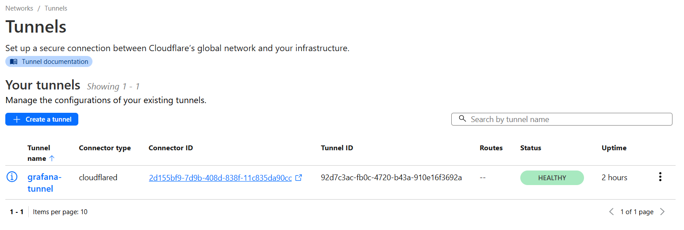
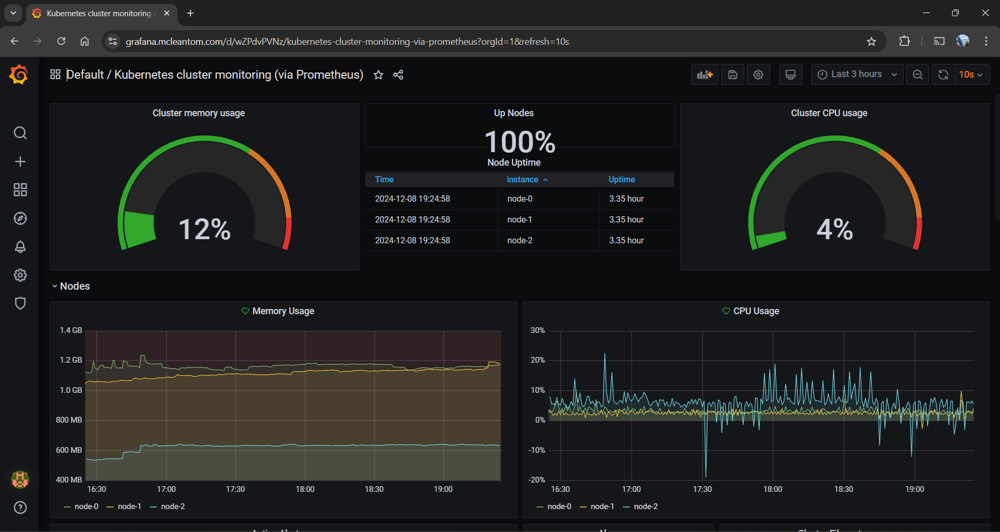

# raspberry-pi-kubernetes-cluster
Making a kubernetes cluster with Raspberry Pis

## Requirements
| Item                                 | Cost   |
| ------------------------------------ | ------ |
| Raspberry Pi v4 8GB                  | £60    |
| Raspberry Pi v5 8GB                  | £120   |
| Raspberry Pi PoE Hat                 | £60    |
| 5x0.5m CAT6 Ethernet Cable           | £8     |
| TP-Link TL-SF1005P 5-Port PoE Switch | £25    |
| TP-Link Nano Router WLAN             | £25    |
| 3x32GB MicroSD Card                  | £12    |
| Total                                | £310   |

## Raspberry pi setup

Install the Raspberry Pi Imager, then for the operating system select Ubuntu Server 24.10 (64-bit). For the other settings, make sure you dont add wifi settings as otherwise it wont connect to the TP Link Mini Router.

## Setting up TP Link Mini Router

To setup the switch and the router, connect the mini router to the 5th slot on the swtich, then the raspberry pis can connect on 1-4.

Connect your dev pc to the mini router's wifi network, then:

1. Quick Setup
2. WISP mode
3. Dynamic IP
4. Connect to your home wifi
5. Then go to Network -> LAN and set the ip address to 10.44.44.1 and subnet mask to 255.255.255.0. Whatever you do, dont
set it to be 10.44.44.1 or 10.43.43.1 as these are used by kubernetes by default and caused me two days of pain by using.
6. Then go to DHCP->DHCP Settings and set:
 
7. I then gave my raspberry pi's a fixed IP by first connecting them to the switch, getting their MAC address then going to DHCP->Address Reservation. I think its possible to set this via the config file at /etc/dhcpcd.conf but I am not sure how to set that before connecting to the network anyway.

## Ansible setup

Create a virtual environment and install ansible:

```
python -m venv env
source ./env/bin/activate
pip install ansible
```

I had to copy my ssh key to the raspberry pis, so make sure you have generated a SSH key on your machine, then run:

```
ssh-copy-id tom.mclean@10.44.44.100
ssh-copy-id tom.mclean@10.44.44.101
ssh-copy-id tom.mclean@10.44.44.102
```

Then you can ping the machines with ansible:
```
(env) mclean@tommclean:~/src/raspberry-pi-kubernetes-cluster/ansible$ ansible k3s_cluster -m ping -i inventory.ini
[WARNING]: Platform linux on host 10.44.44.101 is using the discovered Python interpreter
at /usr/bin/python3.12, but future installation of another Python interpreter could change
the meaning of that path. See https://docs.ansible.com/ansible-
core/2.18/reference_appendices/interpreter_discovery.html for more information.
10.44.44.101 | SUCCESS => {
    "ansible_facts": {
        "discovered_interpreter_python": "/usr/bin/python3.12"
    },
    "changed": false,
    "ping": "pong"
}
[WARNING]: Platform linux on host 10.44.44.102 is using the discovered Python interpreter
at /usr/bin/python3.12, but future installation of another Python interpreter could change
the meaning of that path. See https://docs.ansible.com/ansible-
core/2.18/reference_appendices/interpreter_discovery.html for more information.
10.44.44.102 | SUCCESS => {
    "ansible_facts": {
        "discovered_interpreter_python": "/usr/bin/python3.12"
    },
    "changed": false,
    "ping": "pong"
}
[WARNING]: Platform linux on host 10.44.44.100 is using the discovered Python interpreter
at /usr/bin/python3.12, but future installation of another Python interpreter could change
the meaning of that path. See https://docs.ansible.com/ansible-
core/2.18/reference_appendices/interpreter_discovery.html for more information.
10.44.44.100 | SUCCESS => {
    "ansible_facts": {
        "discovered_interpreter_python": "/usr/bin/python3.12"
    },
    "changed": false,
    "ping": "pong"
}
```

You can then run the `install_docker.yaml` playbook:

```
ansible-playbook -i inventory.yaml install_docker.yaml --ask-become-pass
```

To install k3s on the raspberry pi's, run:
```
ansible-playbook playbooks/site.yaml -i inventory.yaml --ask-become-pass
```

## Controlling kubernetes from your pc

First install kubectl:
```
curl -LO "https://dl.k8s.io/release/$(curl -L -s https://dl.k8s.io/release/stable.txt)/bin/linux/amd64/kubectl"
sudo install -o root -g root -m 0755 kubectl /usr/local/bin/kubectl
```

Then make a copy of your server k3s config on the server machine:
```
ssh tom.mclean@10.44.44.100
sudo cp /etc/rancher/k3s/k3s.yaml /home/tom.mclean/k3s.yaml
sudo chown tom.mclean:tom.mclean k3s.yaml
```
Then copy it to your machine:
```
scp tom.mclean@10.44.44.100:/home/tom.mclean/k3s.yaml ~/k3s-config.yaml
export KUBECONFIG=~/k3s-config.yaml
```
Then modify the address in the config to the master node's address `10.44.44.100`, then you can see the nodes:
```
mclean@tommclean:~$ kubectl get nodes
NAME     STATUS   ROLES                  AGE   VERSION
node-0   Ready    control-plane,master   14h   v1.31.3+k3s1
node-1   Ready    <none>                 14h   v1.31.3+k3s1
node-2   Ready    <none>                 14h   v1.31.3+k3s1
```

## Metrics Cluster

clone https://github.com/carlosedp/cluster-monitoring

run:
```
apt-get install -y build-essential golang
```

in `vars.jsonnet`, modify armExporter to true and k3s.enabled to true, and set master ip to `10.44.44.100`. Then run:
```
make vendor
make
make deploy
```

## Deploying a service to cloudflare

To deploy a website, we are going to use cloudflare tunnels. This allows us to continuously deploy the website without worrying about ip addresses changing, and also increased security from DDoS attacks by using cloudflare, and not having to expose ports on our router.

First start by buying a domain on cloudflare, it is possible to do this with a domain registered on another site, but you would need a business plan or higher.

First create the cloudflare namespace:
```
kubectl create namespace cloudflare
```

Then go to the [API Tokens](https://dash.cloudflare.com/profile/api-tokens) section of cloudflare and generate a token with the permissions:
1. Account:Cloudflare tunnel:read
2. Zone:DNS:Edit

Then add your api key as a secret:
```
kubectl create secret generic cloudflare-api-key \
  --from-literal=apiKey=<your-api-key> \
  --from-literal=email=<your-email> \
  --namespace=cloudflare
```

Then on your master node, install `cloudflared` [instructions here](https://pkg.cloudflare.com/index.html). Then get credentials by running `cloudflared tunnel login`. Then create a tunnel:
```
$ cloudflared tunnel create demo-lab
Tunnel credentials written to /home/tom.mclean/.cloudflared/554363d7-1d8b-4aa8-b95f-99d9bad58761.json. cloudflared chose this file based on where your origin certificate was found. Keep this file secret. To revoke these credentials, delete the tunnel.

Created tunnel demo-lab with id 554363d7-1d8b-4aa8-b95f-99d9bad58761
```
Then add those credentials as a secret:
```
kubectl create secret generic tunnel-credentials \
  --from-file=credentials.json=/home/admin/.cloudflared/554363d7-1d8b-4aa8-b95f-99d9bad58761.json \
  --namespace=cloudflare
```

Then on the cloudflare admin page, go to `SLL/TLS`->`Overview` and change the mode from flexible to full.

You can then configure a tunnel to point at a service like:
```
cloudflare:
  tunnelName: "grafana-tunnel"
  tunnelId: "92d7c3ac-fb0c-4720-b43a-910e16f3692a"
  secretName: "tunnel-credentials"
  ingress:
    - hostname: "grafana.mcleantom.com"
      service: "http://grafana.monitoring.svc.cluster.local:3000"
      originRequest:
        noTLSVerify: true

resources:
  limits:
    cpu: "100m"
    memory: "128Mi"
  requests:
    cpu: "100m"
    memory: "128Mi"

replicaCount: 1
```
(Alternatively, you could point it towards a load balancer like nginx or traefik and use a wildcard domain like *.mcleantom.com)

Then deploy that:
```
helm repo add cloudflare https://cloudflare.github.io/helm-charts
helm repo update
helm upgrade --install cloudflare cloudflare/cloudflare-tunnel \
  --namespace cloudflare \
  --values tunnel-values.yaml \
  --wait
```

you can then check that the cloudflare tunnel pod is running:
```
$ kubectl get deploy -n cloudflare cloudflare-cloudflare-tunnel
NAME                           READY   UP-TO-DATE   AVAILABLE   AGE
cloudflare-cloudflare-tunnel   1/1     1            1           7m27s
```

And you can search for "tunnels" and see that it is healthy:


We can then also use helm create a pod which is able to modify our cloudflare dns based on annotations of pods:
```
helm repo add kubernetes-sigs https://kubernetes-sigs.github.io/external-dns/
helm repo update
helm upgrade --install external-dns kubernetes-sigs/external-dns \
  --namespace cloudflare \
  --set sources[0]=ingress \
  --set policy=sync \
  --set provider.name=cloudflare \
  --set env[0].name=CF_API_TOKEN \
  --set env[0].valueFrom.secretKeyRef.name=cloudflare-api-key \
  --set env[0].valueFrom.secretKeyRef.key=apiKey \
  --wait
```
We can then create an ingress for the grafana dashpage that is exposed via the cloudflare tunnel:
```
apiVersion: networking.k8s.io/v1
kind: Ingress
metadata:
  annotations:
    external-dns.alpha.kubernetes.io/cloudflare-proxied: "true"
    external-dns.alpha.kubernetes.io/hostname: grafana.mcleantom.com
    external-dns.alpha.kubernetes.io/target: <TUNNEL_ID>.cfargotunnel.com
  name: grafana-ingress
  namespace: monitoring
spec:
  rules:
  - host: grafana.mcleantom.com
    http:
      paths:
      - backend:
          service:
            name: grafana
            port:
              number: 3000
        path: /
        pathType: Prefix
```
Which can be applied using:
```
kubectl apply -f grafana-ingress.yaml
```

After a short amount of time, you should be able to see the grafana dashboard from the internet!

I'm not sure why cpu usage is sometimes negative...

## How to rebuild an x86 Docker image for ARM

